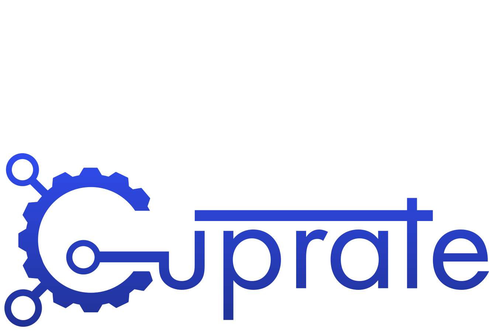

	

An alternative Monero node implementation.

_(work-in-progress)_

 

## Contents

- [About](#about)
- [Books](#books)
- [Crates](#crates)
- [Contributing](#contributing)
- [Security](#security)
- [License](#license)

<!--
TODO: add these sections someday.
- [Status](#status) // when we're near v1.0.0
- [Getting help](#getting-help) // issue tracker, user book, matrix channels, etc
- [Build](#build)
	- [Windows](#windows)
	- [macOS](#macOS)
	- [Linux](#Linux)
-->

## About

Cuprate is an effort to create an alternative [Monero](https://getmonero.org) node implementation
in [Rust](http://rust-lang.org).

It will be able to independently validate Monero consensus rules, providing a layer of security and redundancy for the
Monero network.

<!-- TODO: add some details about what Cuprate is and is not, goals, status -->

## Books

_Cuprate is currently a work-in-progress; documentation will be changing/unfinished._

Cuprate maintains various documentation books:

| Book                                                            | Description                                                |
|-----------------------------------------------------------------|------------------------------------------------------------|
| [Cuprate's architecture book](https://architecture.cuprate.org) | Documents Cuprate's internal architecture & implementation |
| [Monero's protocol book](https://monero-book.cuprate.org)       | Documents the Monero protocol                              |
| [Cuprate's user book](https://user.cuprate.org)                 | Practical user-guide for using `cuprated`                  |

## Crates
For a detailed list of all crates, see: <https://architecture.cuprate.org/appendix/crates.html>.

For crate (library) documentation, see: <https://doc.cuprate.org>. This site holds documentation for Cuprate's crates and all dependencies. All Cuprate crates start with `cuprate_`, for example: [`cuprate_database`](https://doc.cuprate.org/cuprate_database).

## Contributing

See [`CONTRIBUTING.md`](CONTRIBUTING.md).

## Security

Cuprate has a responsible vulnerability disclosure policy, see [`SECURITY.md`](SECURITY.md).

## License

The `binaries/` directory is licensed under AGPL-3.0, everything else is licensed under MIT.

See [`LICENSE`](LICENSE) for more details.
