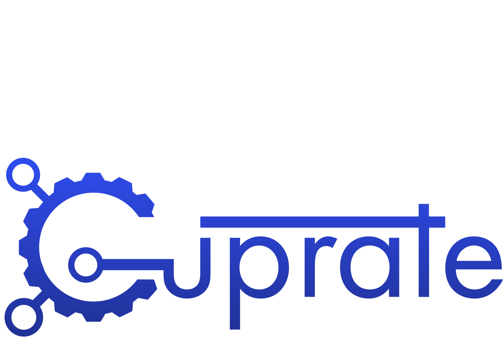

	

An alternative Monero node implementation.

_(work-in-progress)_

 

## Contents

- [About](#about)
- [Books](#books)
- [Build](#build)
- [Crates](#crates)
- [Contributing](#contributing)
- [Security](#security)
- [License](#license)

## About

Cuprate is an effort to create an alternative [Monero](https://getmonero.org) node implementation
in [Rust](https://rust-lang.org).

It is able to independently validate Monero consensus rules, providing a layer of security and redundancy for the
Monero network.

See <https://user.cuprate.org> for more details.

## Books

_Cuprate is currently a work-in-progress; documentation will be changing/unfinished._

Cuprate maintains various documentation books:

| Book                                                            | Description                                                |
|-----------------------------------------------------------------|------------------------------------------------------------|
| [Monero's protocol book](https://monero-book.cuprate.org)       | Documents the Monero protocol                              |
| [Cuprate's user book](https://user.cuprate.org)                 | Practical user-guide for using `cuprated`                  |

## Build

To build Cuprate from source code, see <https://user.cuprate.org/getting-started/source.html>.

## Crates
For a detailed list of all crates, see: <https://architecture.cuprate.org/appendix/crates.html>.

For crate (library) documentation, see: <https://doc.cuprate.org>. This site holds documentation for Cuprate's crates and all dependencies. All Cuprate crates start with `cuprate_`, for example: [`cuprate_database`](https://doc.cuprate.org/cuprate_database).

## Contributing

See [`CONTRIBUTING.md`](/CONTRIBUTING.md).

## Security

Cuprate has a responsible vulnerability disclosure policy, see [`SECURITY.md`](/SECURITY.md).

## License

The `binaries/` directory is licensed under AGPL-3.0, everything else is licensed under MIT.

See [`LICENSE`](/LICENSE) for more details.
