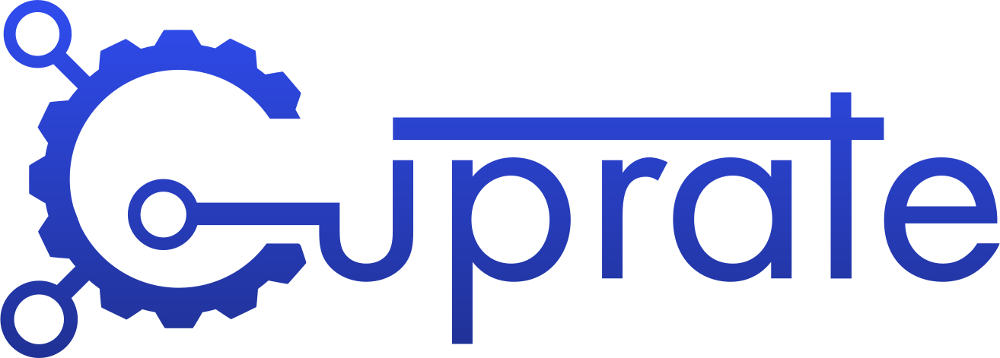

	

An alternative Monero node implementation.

_(work-in-progress)_

 

## Contents
- [About](#about)
- [Documentation](#documentation)
- [Contributing](#contributing)
- [Security](#security)
- [License](#license)

<!--
TODO: add these sections someday.
- [Status](#status) // when we're near v1.0.0
- [Getting help](#getting-help) // issue tracker, user book, matrix channels, etc
- [Build](#build)
	- [Windows](#windows)
	- [macOS](#macOS)
	- [Linux](#Linux)
-->

## About
Cuprate is an effort to create an alternative [Monero](https://getmonero.org) node implementation in [Rust](http://rust-lang.org). It will be able to independently validate Monero consensus rules, providing a layer of security and redundancy for the Monero network.

<!-- TOOD: add some details about what Cuprate is and is not, goals, status -->

## Documentation
_Cuprate is currently a work-in-progress; documentation will be changing/unfinished._

Cuprate maintains various documentation books:
- [Cuprate's architecture book](https://github.com/Cuprate/architecture-book)
- [Cuprate's protocol book](https://github.com/Cuprate/monero-book)
- [Cuprate's user book](https://github.com/Cuprate/user-book)

For crate documentation, see the `cargo doc`s of the crates inside the [workspace](Cargo.toml), and the `README.md` inside the crate's directory if applicable, for example: [`storage/cuprate-blockchain/README.md`](storage/cuprate-blockchain/README.md).

## Contributing
See [`CONTRIBUTING.md`](CONTRIBUTING.md).

## Security
Cuprate has a responsible vulnerability disclosure policy, see [`SECURITY.md`](SECURITY.md).

## License
The `binaries/` directory is licensed under AGPL-3.0, everything else is licensed under MIT.

See [`LICENSE`](LICENSE) for more details.